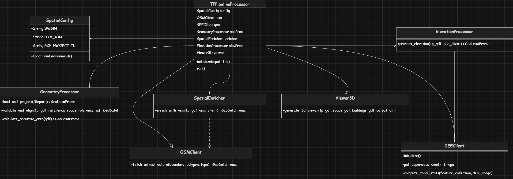

# Urban Land Intelligence Pipeline: System Architecture & Pseudocode

## 1. Enterprise System Architecture Diagram
This diagram illustrates the separation of concerns, showing how the central Orchestrator manages the flow of data between internal transformation engines and external cloud APIs.



## 2. Pipeline Pseudocode

The following pseudocode represents the strict Object-Oriented Programming (OOP) and Dependency Injection patterns used to build the pipeline.

### A. Core Configurations & Adapters (External APIs)
```python
CLASS SpatialConfig:
    DEFINE WGS84 = "EPSG:4326"
    DEFINE UTM_43N = "EPSG:32643"
    DEFINE GCP_PROJECT_ID = LoadFromEnvironment()

CLASS OSMClient:
    METHOD fetch_infrastructure(boundary_polygon, type):
        TRY:
            IF type == 'buildings': SET tag = 'building'
            ELSE IF type == 'roads': SET tag = 'highway'
            ELSE IF type == 'all': SET tag = 'building' AND 'highway'
            
            QUERY OSMnx for features within boundary_polygon using tag
            RETURN filtered GeoDataFrame
        CATCH Error:
            RETURN Empty GeoDataFrame

CLASS GEEClient:
    METHOD initialize():
        AUTHENTICATE with Google Earth Engine
        
    METHOD get_copernicus_dem():
        RETURN EarthEngine.ImageCollection('COPERNICUS/DEM/GLO30').mosaic()
        
    METHOD compute_zonal_stats(feature_collection, dem_image):
        DEFINE reducer = Mean AND MinMax
        RETURN dem_image.reduceRegions(feature_collection, reducer)
```
### B. Transformation Layer (Business Logic)
```python
CLASS GeometryProcessor:
    METHOD load_and_project(filepath):
        READ GeoJSON using pyogrio
        PROJECT to UTM_43N for metric calculations
        RETURN projected_gdf

    METHOD validate_and_align(tp_gdf, reference_roads, tolerance_m):
        FOR EACH plot boundary IN tp_gdf:
            CALCULATE distance to nearest reference_road
            STORE distance, dx, dy
            
        CALCULATE Mean Positional Error (MPE)
        
        IF MPE > tolerance_m:
            CALCULATE median_dx, median_dy
            APPLY Affine Translation (Shift tp_gdf by median_dx, median_dy)
            
        RETURN aligned_gdf

    METHOD calculate_accurate_area(gdf):
        CALCULATE Area = gdf.geometry.area (in square meters)
        RETURN gdf

CLASS SpatialEnricher:
    METHOD enrich_with_osm(tp_gdf, osm_client):
        FETCH buildings AND roads from OSM
        
        PERFORM Spatial Join (tp_gdf INTERSECTS buildings)
        IF count > 0: SET is_built = True ELSE False
        
        PERFORM Topological Intersection (roads CLIPPED TO tp_gdf)
        CALCULATE road_length_m per plot
        
        IF is_built AND road_length_m < 5m: SET anomaly = "Missing Access"
        ELSE IF NOT is_built AND road_length_m > 50m: SET anomaly = "Extra Road"
        
        RETURN enriched_gdf

CLASS ElevationProcessor:
    METHOD process_elevation(tp_gdf, gee_client):
        CONVERT tp_gdf to EarthEngine.FeatureCollection
        FETCH DEM from gee_client
        
        EXECUTE gee_client.compute_zonal_stats
        DOWNLOAD results to local memory
        
        MAP elev_mean, elev_max, elev_min to tp_gdf
        RETURN elevated_gdf
```
### C. Visualization Layer
```python
CLASS Viewer3D:
    METHOD generate_3d_viewer(tp_gdf, roads_gdf, buildings_gdf, output_dir):
        PROJECT all GDFs to WGS84
        CONVERT all GDFs to GeoJSON Strings
        
        DEFINE HTML_Template:
            IMPORT MapLibre, Turf.js, Mapbox Draw
            INJECT tp_geojson, roads_geojson, buildings_geojson as JavaScript Constants
            
            SETUP Map Engine (Center on tp_geojson)
            
            ADD LAYER OSM_Roads (Style: Dark Lines)
            ADD LAYER OSM_Buildings (Style: Grey Extrusion, Opacity 0.5)
            ADD LAYER TP_Plots:
                EXTRUDE HEIGHT based on 'elev_mean'
                COLOR based on 'is_built' (Orange=Built, Green=Vacant)
                
            SETUP Click Listener:
                ON CLICK TP_Plot: Show Popup with Area, Elevation, Status, Anomalies
                
            SETUP Turf.js Listener:
                ON DRAW Polygon: Calculate and display intersection area
                
        WRITE HTML_Template to "index.html" in output_dir

```

### D. The Orchestrator (Dependency Injection)

```python
CLASS TPPipelineProcessor:
    METHOD initialize(input_file):
        INSTANTIATE SpatialConfig
        INSTANTIATE Clients (OSMClient, GEEClient)
        INSTANTIATE Processors (GeometryProcessor, SpatialEnricher, ElevationProcessor, Viewer3D)
        PASS Clients into Processors (Dependency Injection)

    METHOD run():
        # 1. Geometry & Alignment
        tp_utm = GeometryProcessor.load_and_project(input_file)
        osm_context = OSMClient.fetch_infrastructure(type='all')
        tp_utm = GeometryProcessor.validate_and_align(tp_utm, osm_context.roads)
        tp_utm = GeometryProcessor.calculate_accurate_area(tp_utm)
        
        # 2. Enrichment
        tp_enriched = SpatialEnricher.enrich_with_osm(tp_utm)
        
        # 3. Elevation
        tp_elevation = ElevationProcessor.process_elevation(tp_enriched)
        
        # 4. Visualization
        Viewer3D.generate_3d_viewer(tp_elevation, osm_context.roads, osm_context.buildings)
        
        SAVE all intermediary files as GeoJSON
        PRINT "Pipeline Completed Successfully"

# Execution Entry Point
IF __name__ == "__main__":
    pipeline = TPPipelineProcessor(input_file="data/input/tp_scheme.geojson")
    pipeline.run()
```